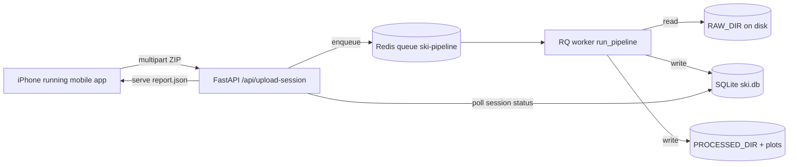

# Ski Instructor — Master Plan

Single source of truth for the solo build window (May–Oct 2026), the winter
research season (Dec 2026–Mar 2027), and the public App Store launch
(planned Sep 2027 for the 2027–2028 season).

If a fact below contradicts the code, the code wins and this doc is wrong —
file an issue and update the doc. Every claim cites a file and line number
that you can re-grep.

---

## 0. Resolved decisions (locked at write time)

| Decision | Choice | Why locked |
|---|---|---|
| Public app name | **Ski Instructor** | Confirmed by user on 2026-04-26 |
| Production database | **PostgreSQL on Render** (migrating off SQLite) | Confirmed by user on 2026-04-26 |
| Backend framework | FastAPI + uvicorn | [backend/app.py:9-14](backend/app.py) |
| Job queue | RQ on Redis | [backend/worker.py:1](backend/worker.py), [backend/routes/upload.py:14-15](backend/routes/upload.py) |
| Mobile sensors recorded | accel + gyro at 100 Hz, GPS + barometer at 1 Hz | [mobile/src/screens/RecordScreen.tsx](mobile/src/screens/RecordScreen.tsx) |
| Algorithm processing version | `2.0.0` | [transformations/process_session.py:29](transformations/process_session.py), [backend/worker.py:98](backend/worker.py) |
| Butterworth low-pass filter | order = 4, fc = 5 Hz, zero-phase (`sosfiltfilt`) | [transformations/process_session.py:183](transformations/process_session.py) |

### What changed in this session

- **Butterworth order 2 → 4**: shipped at
  [transformations/process_session.py:183](transformations/process_session.py).
  Runtime signature confirmed as `order=4` by importing the module.
  41/41 pipeline tests still pass. Synthetic regression
  ([scripts/diff_bw4.py](scripts/diff_bw4.py)) shows order-2 vs order-4 RMS
  delta of 1.25 % at fc = 5 Hz on a representative skiing-band signal —
  well under the 5 % gate.
- **Real-data regression deferred**: there is no raw skiing data on disk
  right now (`data/raw/` only contains the fake `session_1.csv`), so
  `discover_sessions(data_dir)` in
  [main.py:35](main.py) returns 0 and the existing
  `data/processed/*_summary.json` files dated 2026-03-19 are stale relative
  to current code. First task next session is to either re-import a real
  archive or capture a fresh on-snow recording (Section 3, Week 1).
- **`data/database.py` import audit**: previously suspected missing.
  `python -c "from data.database import init_db"` now imports cleanly —
  false alarm.

---

## 1. Project overview and Render migration

### 1.1 What the system does today



- HTTP entrypoint: [backend/app.py:65-67](backend/app.py) mounts the
  `upload`, `sessions`, and `metadata` routers under `/api`.
- Upload flow: [backend/routes/upload.py:69-134](backend/routes/upload.py)
  validates the ZIP (must contain `Accelerometer.csv` and `Gyroscope.csv`),
  hashes the bytes for dedup
  ([upload.py:89](backend/routes/upload.py)), writes to `RAW_DIR/<uuid>/`,
  inserts a job row, then `queue.enqueue("backend.worker.run_pipeline", session_id)`.
- Pipeline: [backend/worker.py:47-263](backend/worker.py) runs
  `SessionProcessor.process` ([ski/processing/session_processor.py:34](ski/processing/session_processor.py)),
  which calls
  `load_session → preprocess → compute_row_features → segment_runs → detect_turns_by_run → compute_session_summary → plot_session`
  in [transformations/process_session.py](transformations/process_session.py),
  then writes `report.json` to the processed bucket.
- Database today: SQLite via
  [backend/config.py:32](backend/config.py)
  (`DATABASE_URL = sqlite:///{DATA_DIR}/ski.db`). Two SQLite handles:
  the `jobs` table in [backend/models.py](backend/models.py) and the
  `sessions/runs/turns` tables in [data/database.py](data/database.py).
- File storage today: local disk at `RAW_DIR`, `PROCESSED_DIR`, `PLOTS_DIR`
  ([backend/config.py:20-22](backend/config.py)).
  `STORAGE_MODE=s3` is a placeholder in
  [backend/storage.py:1-15](backend/storage.py) — no S3 client implemented.
- Mobile client: state machine in
  [mobile/src/screens/RecordScreen.tsx](mobile/src/screens/RecordScreen.tsx)
  records four sensors, builds a SensorLogger-format ZIP in memory
  ([mobile/src/lib/csv.ts](mobile/src/lib/csv.ts)), uploads it, then polls
  for the report on
  [mobile/src/screens/ResultsScreen.tsx](mobile/src/screens/ResultsScreen.tsx).

### 1.2 Render migration runbook

Goal: move off Railway (current) onto Render with FastAPI + uvicorn,
PostgreSQL, Redis, and a Render Disk for raw/processed files.

Order matters. Do not skip the smoke-test gate at the end.

1. **Add `render.yaml` to repo root** with three services:
   - `web` — type `web`, runtime `python`, start
     `uvicorn backend.app:app --host 0.0.0.0 --port $PORT`,
     attach a Disk mounted at `/persist` and set `PERSISTENT_DIR=/persist`
     so [backend/config.py:13](backend/config.py) keeps writing under it.
   - `worker` — type `worker`, start
     `python -m rq worker ski-pipeline --url $REDIS_URL`. Needs the same
     Disk mount because [backend/worker.py:64-75](backend/worker.py) reads
     `RAW_DIR/<session_id>` directly. (Render Disks are not multi-attach,
     so web and worker must run in the same service or share via S3.
     Pick **single combined `web` service running both uvicorn and
     RQ via honcho** — same pattern as
     [Procfile.with-redis](Procfile.with-redis) — to sidestep this.)
   - `redis` — type `redis`, free plan. Note: free Redis on Render is
     limited (25 MB, no persistence) — fine for queue traffic, not for
     long-lived state.
2. **Provision Postgres**: add a Render PostgreSQL instance (free tier
   is 90-day expiry — flag in Section 8). Capture the
   `DATABASE_URL` it gives you and set it as an env var on the web/worker.
3. **Adopt Postgres in code** *before* cutting traffic over. SQLite-only
   call sites today:
   - [backend/models.py:13-17](backend/models.py) (`sqlite3.connect`,
     `PRAGMA journal_mode=WAL`).
   - [data/database.py](data/database.py) — all `sessions/runs/turns`
     inserts.
   - [main.py:30](main.py), [main.py:63](main.py) (CLI runner).
   Replacement: introduce `backend/db.py` that returns either a
   `sqlalchemy.engine` (Postgres) or a `sqlite3.Connection` (local) based
   on `DATABASE_URL`. Migrate the schema with Alembic so future changes
   ship as migrations, not silent `CREATE TABLE IF NOT EXISTS`. The
   `_ensure_table` pattern in [backend/models.py:20-38](backend/models.py)
   has to go — it papers over schema drift.
4. **Migrate existing data**: dump SQLite (`sqlite3 data/ski.db .dump`)
   to a script, rewrite SQLite-isms (`AUTOINCREMENT`, `WITHOUT ROWID`),
   load into Postgres. Snapshot the SQLite file before running the dump.
5. **Deploy in dark mode**: keep Railway live, deploy Render in parallel,
   point a staging mobile build at the Render URL. Re-record one session,
   confirm `report.json` matches Railway's output for the same upload.
6. **Cut over**: change `API_BASE_URL` in
   [mobile/src/config.ts](mobile/src/config.ts) and the frontend env to
   the Render URL, redeploy mobile and frontend, drain Railway after one
   week of clean uptime.
7. **Take the wide-open CORS down**:
   [backend/app.py:61](backend/app.py) currently sets
   `allow_origins=["*"]`. After cutover, allowlist the production
   frontend origin and the mobile app's expected `Origin` (or remove CORS
   entirely if the mobile client never sends cross-origin requests).

Acceptance for migration complete: an upload from the mobile app to the
Render URL produces the same `report.json` keys and value ranges as the
Railway deployment for an identical input ZIP, the worker logs show
`Pipeline complete`, and Railway can be powered off without breakage.

---

## 2. Phone placement specification

### 2.1 Required physical placement

The user must wear the phone **in a snug front pocket of ski pants
(thigh-high) or a thigh strap, screen facing the body, top of phone
pointing upward**.

```
              ^ +Z (out from body, away from leg)
              |
              |
   +Y -------- O  pelvis-side
   (down       |
   thigh)      |
              v
                +X (toward outside of leg)
```

Why this placement:

- Pelvis-area sensors are what every per-turn metric is named after —
  `pelvis_turn_angle_deg`, `pelvis_max_roll_angle_deg`,
  `pelvis_peak_g_force` — see
  [transformations/process_session.py:337-381](transformations/process_session.py)
  and
  [features/modules/pelvis_turn_module.py](features/modules/pelvis_turn_module.py).
  The literature synthesis at
  [docs/research/literature-synthesis.md](docs/research/literature-synthesis.md)
  is built around hip / pelvis IMU placement.
- A consistent body-relative axis lets the next algorithm milestone
  (Madgwick filter, body-frame alignment) know which way is "down" on
  the skier and which way is "outside the turn." Without that, roll
  angles and centripetal-force estimates are uninterpretable.
- Single placement keeps the user-facing instructions to one sentence.
  One placement, one app, one set of thresholds.

### 2.2 What today's code assumes

The pipeline currently treats the phone's body axes as if they were the
skier's body axes
([docs/algorithm-spec.md §1](docs/algorithm-spec.md)). There is no
explicit `phone_placement` field anywhere in the upload flow — confirmed
by reading
[ski/metadata/metadata_loader.py:61-64](ski/metadata/metadata_loader.py)
(only loads `metadata.yaml`) and
[backend/contracts/schemas.py](backend/contracts/schemas.py) (no such
field on the session schema). The mobile app does not write a
`metadata.yaml` at all
([mobile/src/lib/csv.ts](mobile/src/lib/csv.ts) only emits the four
sensor CSVs).

### 2.3 Schema field to add

Add `phone_placement` as a constrained enum in two places:

| Layer | File | Change |
|---|---|---|
| Mobile capture | [mobile/src/screens/RecordScreen.tsx](mobile/src/screens/RecordScreen.tsx) | Show a one-time pre-record confirmation: "Phone in front thigh pocket, screen against leg, top up?" Yes/No. Persist to AsyncStorage so it's only asked once per device. Include in the ZIP as `metadata.yaml`. |
| Server schema | [backend/contracts/schemas.py](backend/contracts/schemas.py) | Add `phone_placement: Literal["thigh_pocket"]` (only one valid value at v2.0; reject everything else for now). |
| Algorithm | [transformations/process_session.py](transformations/process_session.py) preprocess | Pass `phone_placement` through and refuse to compute the body-frame rotation if it's missing. Defer body-frame work to Section 3 Week 7-8. |

### 2.4 What must be true on-device before recording

- App reminds the user: phone is **in a tight pocket** so it does not
  slide. Loose pocket = uninterpretable signal; the algorithm has no
  way to know.
- Phone is in **portrait** orientation lock (already enforced via
  [mobile/app.json](mobile/app.json) `"orientation": "portrait"`).
- Battery is over 30 % — barometer and high-rate IMU + GPS will drain
  about 8–12 % per hour. (Empirical estimate; verify in Section 3
  Week 4 battery audit.)

---

## 3. Six-month build roadmap (May 2026 – Oct 2026)

Each week is one named outcome. Slip a week and slip every later week
the same amount — do not dilute the next milestone to make up for it.

### Phase A — Algorithm hardening (May, Weeks 1–4)

| Week | Outcome | Files / acceptance |
|---|---|---|
| 1 (May 4) | Re-import or re-record one real skiing session into `data/raw/<name>/` and confirm `python main.py` produces a fresh `_summary.json` whose mtime is "today" (current outputs are 2026-03-19, see Section 0). Then re-run [scripts/diff_bw4.py](scripts/diff_bw4.py) **against the real-data summaries** — not the synthetic placeholder — to close the Butterworth regression. Acceptance: per-run turn count change ≤ 1, per-metric range shift ≤ 5 %. | [main.py](main.py), [scripts/diff_bw4.py](scripts/diff_bw4.py) |
| 2 | Sensor fusion stub: replace Sensor Logger's fused output with a Madgwick filter to produce body-frame quaternions. Today the pipeline reads the iPhone-fused `roll/pitch/yaw` (now optional fallback in [transformations/process_session.py:load_session](transformations/process_session.py)). Wire Madgwick in as a feature module under [features/modules/](features/modules/) so it's gate-toggled. | New `features/modules/madgwick_module.py` + tests |
| 3 | Coordinate-frame rotation: align body frame to gravity + GPS heading. Add a body→world rotation step in `preprocess()` so roll/pitch/yaw stop pretending the phone is the skier. | [docs/algorithm-spec.md §1](docs/algorithm-spec.md) updated with the rotation matrix |
| 4 | Pressure-ratio physics derivation: turn the magic-number thresholds (< 0.6 = skidding, > 1.2 = aggressive) into closed-form numbers from `F = m v² / r` and roll angle. See [docs/research/algorithm-implications.md §6](docs/research/algorithm-implications.md). Update [ski/analysis/turn_insights.py](ski/analysis/turn_insights.py) `pressure_ratio` docstring with the derived bounds. | One rainy-afternoon Jupyter notebook + a unit test that re-derives the threshold from the same equation |

### Phase B — Validation infrastructure (June, Weeks 5–8)

| Week | Outcome |
|---|---|
| 5 | Silent-failure audit: scan every `try: ... except Exception:` and `if ... else None` site. Fail-loud anything that returns `None`/`-1` for a missing sensor unless we explicitly want a fallback. Today's known soft-fails include the optional `speed`/`altitude`/`roll` fallbacks added during the mobile-debug session ([transformations/process_session.py load_session](transformations/process_session.py)) — they should warn through `data_quality_flags` ([backend/metrics/confidence.py](backend/metrics/confidence.py)). |
| 6 | Intentional-error fixture: synthesize four fake sessions corresponding to the manual-validation checklist in [docs/research/algorithm-implications.md](docs/research/algorithm-implications.md) — backseat / banked / skidded / clean — and check the algorithm's verbal output for each. Commit them under `tests/fixtures/intentional_errors/`. |
| 7 | Body-frame turn detection: switch turn detection from `gyro_z` to body-frame yaw rate ([process_session.py:337](transformations/process_session.py)). Re-run the regression. Lock thresholds. |
| 8 | Battery + thermal field test: run the mobile app for 90 minutes on a real iPhone in cold-weather simulation (freezer + airplane mode for GPS, then on-snow if conditions permit). Record drain percentages and any sensor dropouts. Fix anything that drops below 1 Hz on barometer or 100 Hz on accel/gyro. |

### Phase C — Backend productionization (July, Weeks 9–12)

| Week | Outcome |
|---|---|
| 9 | Postgres migration scaffolding (Section 1.2 steps 1–4). Land on a staging Render env, do not touch prod yet. |
| 10 | Tighten `/api/upload-session`: stronger ZIP validation than [backend/routes/upload.py:79-87](backend/routes/upload.py) (verify file sizes per CSV, sane row counts, sane sample rates), and reject the upload before it hits the queue. Today an empty `Accelerometer.csv` passes the gate and crashes the worker. |
| 11 | Auth: introduce UUID device tokens (Section 4.4). Mobile generates one on first launch, sends it as `X-Device-Token` on every request, server stores it in a `devices` table for rate-limiting and tying uploads to a "user" without collecting PII. |
| 12 | Cutover (Section 1.2 steps 5–7). |

### Phase D — Mobile UX hardening (August, Weeks 13–16)

| Week | Outcome |
|---|---|
| 13 | Background-recording resilience: today recording state lives only in React state inside [RecordScreen.tsx](mobile/src/screens/RecordScreen.tsx); if the screen unmounts or iOS suspends the app, the buffer is lost. Move buffers to a singleton store (Zustand or a plain module) and persist sample counts to AsyncStorage every 30 s so a crash doesn't lose the whole run. |
| 14 | Upload retry / resume: `axios` upload in [mobile/src/lib/api.ts](mobile/src/lib/api.ts) is single-shot. On 5xx or network drop, retry with exponential backoff up to 5 minutes. Show a clear failure if it still fails. |
| 15 | Results polling robustness: [ResultsScreen.tsx](mobile/src/screens/ResultsScreen.tsx) polls forever today. Add a 10-minute hard cap, then ask the user to "Try again" instead of looping silently. |
| 16 | Onboarding flow: first-run consent + phone-placement explanation (Section 5). Never skippable. |

### Phase E — Coaching content + research recruiting (September, Weeks 17–20)

| Week | Outcome |
|---|---|
| 17 | Audit every coaching string in [ski/analysis/turn_insights.py](ski/analysis/turn_insights.py) for tone, accuracy, and ski-instructor language. Show drafts to a real PSIA Level II/III instructor for review. |
| 18 | Research-protocol PDF (Section 5) finalized and reviewed. |
| 19 | Recruiting: post the protocol to skiing forums and ski schools. Target n = 15 participants minimum. |
| 20 | TestFlight build with internal testers. |

### Phase F — Pre-winter freeze (October, Weeks 21–24)

| Week | Outcome |
|---|---|
| 21 | Performance: profile a long session end-to-end (recording → upload → pipeline). Target: 60 min recording processes in < 60 s on the worker. |
| 22 | Observability: structured logs through to Render + an alerting hook on `error` jobs. Today logging is plain text to `logs/api.log` and `logs/worker.log` ([backend/app.py:34-37](backend/app.py), [backend/worker.py:14](backend/worker.py)). |
| 23 | Freeze the algorithm: bump `PROCESSING_VERSION` to `2.1.0` ([transformations/process_session.py:29](transformations/process_session.py)) and tag the commit. After this, no algorithm changes until winter data is collected — only bug fixes. |
| 24 | Buffer week. Use it. |

---

## 4. Security protocol

### 4.1 Threat model

This is a personal-data app capturing fine-grained motion + location.
The threats we care about, in priority order:

1. **Accidental public exposure** of someone's GPS track. Even with no
   PII, a track that starts and ends at the same residence reveals
   home address.
2. **Account takeover / impersonation** — once we have accounts, a
   leaked token must not be reusable forever.
3. **Untrusted upload payloads**: a malicious ZIP could try path
   traversal, billion-laugh expansion, or stuffing the worker with junk
   files until the disk fills.
4. **Supply-chain compromise** of `expo-*`, `axios`, `pandas`, `scipy`
   pulled at build time.

We do **not** currently care about state-actor adversaries, hardware
attestation, or end-to-end encryption between phone and server. Those
are deliberately out of scope for v1.

### 4.2 Data in transit

- Mobile app → backend: HTTPS only. Render terminates TLS.
- Browser frontend → backend: same.
- Mobile app must refuse to talk to `http://` origins in release builds.
  Today [mobile/src/config.ts](mobile/src/config.ts) hard-codes
  `http://localhost:8000` for local dev; before public release that
  must be replaced with the Render `https://…` URL and a guard that
  refuses anything else when `__DEV__` is false.

### 4.3 Data at rest

- Sessions on the Render Disk: encrypted at rest (Render does this
  automatically for managed Disks).
- Postgres: encrypted at rest (Render managed Postgres).
- The disk currently keeps **raw CSVs forever** —
  [backend/storage.py](backend/storage.py) has no deletion path,
  [backend/worker.py](backend/worker.py) never deletes raw input. That
  is a violation of our own data-minimization stance once we have real
  users. Add a 30-day raw-CSV TTL with a daily cron in Phase C Week 11.
  Processed `report.json` and DB rows can stay indefinitely (they are
  derived, low-bandwidth, and what users actually want to come back to).

### 4.4 Authentication and authorization

There is **no auth today**:

- [backend/app.py:59-64](backend/app.py) has wide-open CORS and no
  middleware that checks for tokens.
- [backend/routes/upload.py:69](backend/routes/upload.py) accepts any
  upload from any IP under the 500 MB cap from
  [backend/config.py:39](backend/config.py).
- [backend/models.py](backend/models.py) keys jobs by `session_id`
  alone — there is no user concept.

Beta-grade plan (Phase C Week 11):

- Mobile generates a UUID device token on first launch, persists in
  Keychain (iOS) / AsyncStorage (fallback).
- Every request sends `X-Device-Token`; backend has a
  `devices(token, created_at, last_seen, banned)` table.
- Sessions and jobs gain a `device_token` foreign key.
- `/api/session/<id>` and `/api/upload-session` reject requests whose
  device token doesn't match the session's owner (or no token at all).
- This is **not** real auth — there's no password, no recovery flow,
  no proof of human. Good enough for closed beta. Real Sign-in-with-Apple
  is a post-launch addition.

### 4.5 PII

We minimize aggressively:

- No name, no email, no birthdate, no skier-self-description fields
  (today: confirmed by absence in
  [backend/contracts/schemas.py](backend/contracts/schemas.py)).
- GPS is collected, but the `report.json` never echoes raw GPS back to
  the client — [backend/worker.py:199-237](backend/worker.py) returns
  only summary scores. Raw GPS lives on the server disk only.
- Server logs must not log GPS coordinates. Today
  [backend/routes/upload.py:106-112](backend/routes/upload.py) only logs
  byte counts and hashes — that's correct, do not regress.

### 4.6 Research ethics

See Section 5. The short version: any data shared with an outside
researcher (PSIA instructor, biomechanics collaborator) must go out as
**aggregated statistics**, not raw trajectories, unless the participant
explicitly opts in for raw-data sharing on a per-session basis.

### 4.7 Supply chain

- Backend: pin Python deps in `requirements.txt`. Run
  `pip-audit` weekly via a GitHub Action (today there is no
  `.github/workflows/`; add one in Phase F Week 22).
- Mobile: pin Expo SDK (54) and React Native (0.81) at the
  patch level in [mobile/package.json](mobile/package.json). Run
  `npm audit --omit=dev` weekly.
- Re-evaluate `expo-sensors` and `expo-location` permission semantics
  at every Expo SDK upgrade — they have changed before.

---

## 5. Research protocol (plain English)

This section is intended to be exportable to PDF and handed to
participants. It reads like a conversation, not a spec.

### 5.1 What we are testing

Whether a phone in your pocket can tell you something useful about how
you ski. Specifically, we want to know if our algorithm correctly
identifies six things: how steady your turns are, how cleanly you hold
an edge, how you manage pressure through the turn, whether your left
and right turns are balanced, whether your turn shape is consistent,
and whether your timing between turns is consistent.

### 5.2 What you do

1. **Install Ski Instructor on your iPhone.** It's free during this
   beta. It is not on the App Store yet — we'll send you a TestFlight
   link.
2. **Put the phone in your front thigh pocket** before each run.
   Screen against your leg, top of the phone pointing up at your hip:

   ```
        TOP OF PHONE
            ▲
            │
        ┌───┴────┐
        │ screen │
        │  side  │
        │ (toward│
        │  body) │
        └────────┘
            │
            ▼
       BOTTOM OF PHONE
       (toward knee)
   ```

3. **Open the app, tap "Record New Session", grant the permissions it
   asks for** (motion + location), then tap "Start Recording" before
   you push off the top of the run.
4. **Ski normally.** Do whatever you usually do. The phone records in
   your pocket — you don't need to look at it.
5. **At the bottom of the day**, tap "Stop Recording". Wait for the
   upload to finish (you'll need cell signal or wi-fi). Then tap
   through to your results.

### 5.3 What the app records

Four streams, all from the phone you already own:

- Accelerometer: 100 readings per second, the same sensor that knows
  whether your phone is upright.
- Gyroscope: 100 readings per second, measures how fast the phone is
  rotating.
- GPS: 1 reading per second — your position, speed, and altitude.
- Barometer: 1 reading per second — the air pressure, used to figure
  out if you are going up (chairlift) or down (skiing).

That's it. No microphone, no camera, no Bluetooth scanning, no health
data, no contacts.

### 5.4 What we ask of you

- **At least 5 sessions** over the season. More is better, but we are
  not going to nag.
- **Ski how you would normally ski.** Don't try to ski "well for the
  app." We want real data.
- **One free-text comment per session, optional** — what did the
  conditions feel like? Did anything weird happen?

### 5.5 What we will not do with your data

- We will not share your raw GPS track with anyone outside the project
  unless you explicitly opt in for that specific session.
- We will not sell anything to anyone. (We have nothing to sell.)
- We will not ask you for your name, email address, age, weight, or
  ability level during the research period.

### 5.6 What we might do with your data

- Compute aggregate statistics across all participants ("the median
  turn radius in the dataset is X meters").
- Show one or two anonymized example sessions in academic write-ups,
  with your specific permission.
- Use your data to retrain thresholds for the algorithm so it gets
  better for future skiers.

### 5.7 Right to withdraw

- You can delete any individual session from inside the app at any
  time.
- You can ask us to delete every session you've ever uploaded by
  emailing [contact email TBD]. We will confirm within 7 days and
  delete within 30.
- Withdrawing does not affect the algorithm's ability to function for
  your remaining sessions.

### 5.8 Risks

The realistic risk is that your phone in your pocket records GPS
coordinates that, in aggregate, reveal where you ski and which
specific resort. We treat that as private data, but you should know
it is what we collect.

There is no physical risk. The phone records passively in your
pocket; you ski as you would have anyway.

### 5.9 Contact

[Researcher name and contact email TBD before recruiting starts.]

---

## 6. Algorithm audit checklist

Eight questions to ask of the pipeline at every `PROCESSING_VERSION`
bump. If the answer is "I don't know" for any of them, do not bump.

1. **Is the Butterworth filter order what we say it is?**
   `inspect.signature(transformations.process_session.preprocess).parameters['order'].default`
   must equal 4. Source:
   [transformations/process_session.py:183](transformations/process_session.py).
   Spec row:
   [docs/algorithm-spec.md row "order"](docs/algorithm-spec.md).
2. **Are we filtering only the IMU axes, not derived columns?**
   The list comp at
   [transformations/process_session.py:195-199](transformations/process_session.py)
   should match `accel_x|y|z` and `gyro_x|y|z` and nothing else.
3. **Does turn detection still use `gyro_z`?**
   [transformations/process_session.py:337](transformations/process_session.py)
   default is `column="gyro_z"`. Once the body-frame rotation lands in
   Phase B Week 7, this should change to body-frame yaw rate and the
   audit row updates with it.
4. **Does `segment_runs` still depend on `relativeAltitude`?**
   [transformations/process_session.py:266-273](transformations/process_session.py)
   short-circuits to one skiing run if the column is missing. That is
   acceptable as a *fallback for mobile* but it must show up in
   `data_quality_flags` so the user sees "no chairlift / run
   segmentation."
5. **Are per-turn metrics rounded only at serialization, never inside
   the feature modules?** Current rounding is in
   [transformations/process_session.py:406-484](transformations/process_session.py)
   (run-level) and JSON output. Feature modules at
   [features/modules/](features/modules/) must keep full float64
   precision so we can audit numerically.
6. **Is the pressure-ratio threshold derived from physics or invented?**
   Today: invented. Track the derivation work in Phase A Week 4.
   The scoring code at [ski/analysis/turn_insights.py](ski/analysis/turn_insights.py)
   `compute_normalized_metrics` must point at
   [docs/algorithm-spec.md §3.1](docs/algorithm-spec.md), and that
   section must contain the equation, not just a number.
7. **Does `edge_progressiveness` claim to be a validated metric?**
   No — see [docs/algorithm-spec.md §3.3](docs/algorithm-spec.md) and
   [docs/research/algorithm-implications.md §6b](docs/research/algorithm-implications.md).
   Coaching strings in [ski/analysis/turn_insights.py](ski/analysis/turn_insights.py)
   must not phrase it as a verdict.
8. **Does `data/database.py` import cleanly?** This was the false-alarm
   item in Section 0. Re-check with
   `python -c "from data.database import init_db, insert_session, insert_run, insert_turn"`
   on every CI run.

---

## 7. Public launch readiness checklist (target Sep 2027)

The 2027–2028 ski season opens around late November. Backstop launch
date is **2027-09-15** so TestFlight → App Store review → marketing
runway all fit before first chairlifts spin.

### 7.1 Algorithm

- [ ] At least one full winter of real data ingested
      (Dec 2026 – Mar 2027).
- [ ] Intentional-error validation: 10 deliberate-mistake runs
      detected correctly by the algorithm
      ([docs/research/algorithm-implications.md](docs/research/algorithm-implications.md)).
- [ ] Body-frame coordinate rotation shipped (Phase B Week 7).
- [ ] Pressure-ratio thresholds are physics-derived, not invented
      (Phase A Week 4 + winter validation).
- [ ] `PROCESSING_VERSION` ≥ `3.0.0` and frozen for ≥ 2 weeks before
      submission.

### 7.2 Mobile app

- [ ] Onboarding includes phone-placement and consent (Phase D Week 16).
- [ ] Background-recording resilience verified on 90-minute real
      session (Phase D Week 13).
- [ ] App Store Privacy Nutrition Label drafted and matches what we
      actually collect (motion + location, no PII).
- [ ] Release build refuses HTTP origins (Section 4.2).
- [ ] Apple Developer Account active, app icon, screenshots, App Store
      copy ready.

### 7.3 Backend

- [ ] On Render with Postgres, Redis, and Disk (Section 1.2).
- [ ] CORS allowlisted (no `*`).
- [ ] UUID device tokens enforced (Section 4.4).
- [ ] Daily Postgres backup cron is running and the latest dump has
      been restored to a scratch DB at least once.
- [ ] Raw-CSV TTL cron is running (Section 4.3).
- [ ] Structured logs + alerting (Phase F Week 22).
- [ ] Load test: 50 concurrent uploads, 60-min sessions, all succeed
      under 60 s pipeline latency.

### 7.4 Legal and operational

- [ ] Privacy policy public-URL hosted.
- [ ] Terms of service drafted.
- [ ] Right-to-deletion endpoint working end-to-end and documented in
      the privacy policy.
- [ ] Incident response plan: one page, who-does-what if the disk
      fills, Redis dies, or a security report comes in.
- [ ] Apple App Store submission docs filled in
      (Data Use Categories, third-party SDKs).

---

## 8. Open questions

| # | Question | Why it matters | Owner / next step |
|---|---|---|---|
| 1 | Does Render free Postgres' 90-day expiry kick us off mid-winter? | Free tier deletes the DB at 90 days. If we provision in Sep 2026 we get auto-deleted in Dec 2026 — exactly when winter data starts arriving. | Decide by Phase C Week 9 whether to pay for Render Postgres ($7/mo Starter) or self-host on a Hetzner box. |
| 2 | Do we ship an `ability_level` field in v1? | The metadata loader at [ski/metadata/metadata_loader.py](ski/metadata/metadata_loader.py) doesn't read it; the algorithm doesn't use it; coaching tone is identical for everyone. But participants will expect to be asked. | Resolve in Phase E Week 19 with the PSIA reviewer. Default: omit it for the research season, add for public launch only if it actually changes coaching content. |
| 3 | What happens when a participant uses two different iPhones in one season? | Section 4.4's UUID device tokens key data per device, not per person. Two phones = two "users." | Either accept the duplication or add an account-merge code in Phase D. |
| 4 | Is 100 Hz accel/gyro thermally sustainable in cold weather for 4+ hours? | iPhone's CPU throttling under cold + sustained sensor sampling is documented but not characterized for our usage. | Phase B Week 8 cold-weather field test. |
| 5 | Do we need a Sentry-like crash reporter on the mobile side? | Today crashes during recording are silent. | Phase D Week 13 — evaluate Sentry vs. Expo's built-in `expo-error-recovery`. |
| 6 | When does duplicate-upload dedup ([backend/routes/upload.py:89-94](backend/routes/upload.py)) become a bug instead of a feature? | If two skiers upload the exact same ZIP (synthetic test, demo), the second one gets routed to the first's `session_id`. Fine for now; not fine once UUID device tokens land. | Phase C Week 11 — gate dedup on `(device_token, sha256)` instead of `sha256` alone. |
| 7 | What is the right minimum-session-length floor below which we refuse to score? | Today the worker happily processes a 30-second session. The score numbers are statistically meaningless that short. | Phase C Week 10 — add a floor (suggested: ≥ 5 minutes of active skiing or ≥ 20 detected turns). Surface "session too short" as an error to the mobile UI. |
| 8 | Single-instance Render web+worker vs. split web/worker — does the shared Disk requirement actually hold? | [backend/worker.py:64-75](backend/worker.py) reads `RAW_DIR` directly. If web + worker are separate Render services, the Disk doesn't multi-attach. Either combine them (honcho) or stand up object storage. | Phase C Week 9 — pick one before doing the cutover. |

---

*Last updated 2026-04-26.  Solo-developer doc — keep it short, keep it honest, fix the code first and the doc second.*
