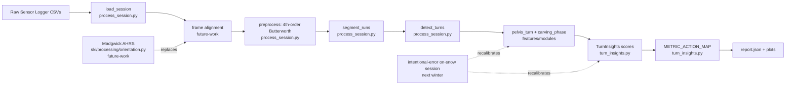

# Algorithm Implications — From Literature to Code

*Engineering-flavored companion to [literature-synthesis.md](literature-synthesis.md).*
*Last updated: April 2026.*

This document is the bridge between the academic record and our
single-IMU, phone-only ski coaching pipeline. Each section names a
layer of the current code, summarizes what the literature says about
it, and then states an explicit decision tagged with one of:

- `[adopt]` — the literature converges on a method we should implement
  directly.
- `[document-as-assumption]` — we keep the current behavior but it
  must be recorded in [../algorithm-spec.md](../algorithm-spec.md) as a
  named assumption with a planned validation step.
- `[future-work]` — the right answer requires sensor or compute we
  do not have today; deferred but tracked.
- `[do-not-claim]` — a metric or accuracy bound the literature says we
  cannot truthfully advertise on a single phone.

Audience: you, future contributors, and any reviewer asking "why is
this number what it is?". The format is decision-first, citation-second.

---

## 0. Summary table

| Layer | File | Decision | Tag |
|-------|------|----------|-----|
| Sensor fusion | [transformations/process_session.py](../../transformations/process_session.py) | Replace Sensor Logger fused angles with our own Madgwick | `[future-work]` |
| Coordinate frames | pipeline-wide | Add per-session gravity + heading alignment | `[future-work]` |
| Filter cutoff | [transformations/process_session.py](../../transformations/process_session.py) `preprocess()` | 4th-order Butterworth LP at 5 Hz (Elfmark 2021); **shipped** — keep fc = 5 Hz | `[adopt]` |
| Down-sample | same | Keep 100 → 20 Hz | `[document-as-assumption]` |
| Run/lift segmentation | same `segment_runs()` | Keep thresholds; document as empirical | `[document-as-assumption]` |
| Turn detection | same `detect_turns()` | Keep height/distance; recalibrate after frame alignment | `[document-as-assumption]` |
| Carving vs skidding | [ski/analysis/turn_insights.py](../../ski/analysis/turn_insights.py) `compute_normalized_metrics()` | Mark `pressure_ratio` as proxy; **derive** zone cutoffs from \(v^2/r\) anchor (§6) before on-snow tuning; do not claim Adelsberger-grade detection | `[do-not-claim]` + `[adopt]` for desk physics |
| Edge build proxy | [features/modules/carving_phase_module.py](../../features/modules/carving_phase_module.py) | `pelvis_edge_build_progressiveness` (deg/s) clipped to [0,1] in `edge_consistency` — often saturated; no literature anchor | `[document-as-assumption]` |
| GPS / speed | [transformations/process_session.py](../../transformations/process_session.py) | Keep apex GPS speed only; never use position for radius | `[adopt]` |
| Centre-of-mass | implicit, pipeline-wide | Treat phone position as CoM proxy at the metre scale only | `[document-as-assumption]` |
| Validation strategy | tests + desk physics + on-snow | Pattern tests; \(v^2/r\) anchoring for `pressure_ratio` zones; then intentional-error tuning; no absolute accuracy claims | `[adopt]` |
| Coaching feedback UX | [ski/analysis/turn_insights.py](../../ski/analysis/turn_insights.py) `METRIC_ACTION_MAP` | Add a future "skilled mode" with score deltas only | `[future-work]` |

The rest of the document expands each row.

---

## 1. Sensor fusion / orientation

**Today.** [transformations/process_session.py](../../transformations/process_session.py)
ingests the `Orientation.csv` file produced by Sensor Logger and keeps
its `yaw`, `roll`, and `pitch` columns directly:

```48:51:transformations/process_session.py
    "Orientation.csv": {
        "prefix": None,
        "keep": ["yaw", "roll", "pitch"],
    },
```

These columns are produced inside Apple Core Motion's `CMDeviceMotion`
and are not under our control. We do not know the fusion algorithm,
the bias-correction schedule, the magnetometer environment handling,
or even whether the values are in radians or degrees on every iOS
release.

**What the literature says.** Madgwick 2010 reaches under 0.6° static
and under 0.8° dynamic RMS attitude error against Vicon, with
β = 0.033 rad/s in IMU mode and β = 0.041 rad/s in MARG mode. The
algorithm is open, deterministic, costs ~109–277 floating-point
operations per update, and works at sample rates as low as 10 Hz.
Tang 2024's SnowMotion uses a similar fusion approach and achieves
correlation > 0.95 vs. Vicon at 60 Hz. Fasel 2013 / 2016 uses
strapdown + per-turn drift correction (Dejnabadi 2005), which is
heavier but tracks under 6° SD on lower-limb segments.

**Decision.** Replace Sensor Logger's fused output with an in-house
Madgwick implementation that consumes raw `Accelerometer.csv`,
`Gyroscope.csv`, and (when present) `Magnetometer.csv`. Initialise
β = 2.5 for the first 10 s of each session, then drop to 0.041 in
MARG mode (we have a magnetometer). Re-derive yaw, roll, pitch from
the resulting quaternion ourselves so the convention is documented
and stable across iOS versions.

**Action.** Add `ski/processing/orientation.py` containing a
`MadgwickAHRS` class and a wrapper that exposes
`add_orientation(df) -> df` to be inserted in `preprocess()`. **Tag:**
`[future-work]` — six-month window, before next-winter validation.

---

## 2. Coordinate frames (largest gap)

**Today.** Every metric in the pipeline uses raw IMU axis labels:

- `gyro_z` is treated as the *turn axis* in
  [features/modules/pelvis_turn_module.py](../../features/modules/pelvis_turn_module.py)
  and in `detect_turns()` of process_session.py.
- `roll` (from Sensor Logger's fused orientation) is treated as the
  *edge angle* in `pelvis_max_roll_angle_deg`.
- `accel_mag` is treated as the *centripetal force magnitude* in
  `pelvis_peak_g_force`.

These three identifications are only correct if the phone is mounted
exactly upright in the pocket with the screen facing the body and the
top of the phone pointing skyward. In real sessions the phone slides,
rotates with the skier's torso, and starts at an arbitrary tilt. We
have *no* per-session calibration step.

**What the literature says.** Every multi-IMU paper in the corpus
performs an explicit body-frame alignment before computing kinematics:

- Fasel 2016 aligns to gravity (vertical axis) and to mean-velocity
  direction (azimuth, derived from the average of left and right
  shank A–P axes over the run).
- Tang 2024 uses a T-pose calibration with the user facing +x.
- Madgwick 2010 derives initial alignment from a pendulum + compass
  + static-Kalman mean.

In all cases the *sensor frame* is converted to a *body frame* and
then to a *world frame* before anything is reported.

**Decision.** Add a `frame_alignment` step that runs once per session,
between `compute_row_features` and `segment_runs` (so it sees the full
session for a stable estimate):

1. **Vertical axis** from the median gravity vector during the first
   30 s of detected lift activity (skier is stationary or moving in a
   straight line vertically). Compute the rotation that maps the median
   gravity into [0, 0, −1] in the new frame.
2. **Heading axis** from the median GPS bearing during the first
   detected skiing run, projected onto the gravity-perpendicular plane.
   This adapts Fasel 2016's "shank A-P axis aligns with mean velocity
   direction" pattern to a chest/pelvis IMU using GPS heading instead
   of a second IMU.
3. **Resulting world frame**: X-east, Y-north, Z-up (matches Tang
   2024). All downstream metrics consume the rotated accel/gyro
   series.

**Action.** Add `ski/processing/frame_alignment.py` and document the
two assumptions in [../algorithm-spec.md](../algorithm-spec.md): the
30 s median-gravity assumption and the "first skiing run is roughly
straight" assumption. **Tag:** `[future-work]` — this unlocks honest
edge-angle and turn-axis claims and should land before any threshold
recalibration.

---

## 3. Filter cutoff and sample rate

**Today.** [transformations/process_session.py](../../transformations/process_session.py)
applies a **4th-order** Butterworth low-pass at 5 Hz via `sosfiltfilt`
(zero-phase by construction), then decimates from 100 Hz to 20 Hz:

```159:186:transformations/process_session.py
def preprocess(df, source_hz=100, cutoff=5.0, order=4, target_hz=20):
    """Timestamp normalisation, Butterworth low-pass filter, down-sample.

    IMU axes are filtered with a *order*-th order zero-phase Butterworth
    low-pass at *cutoff* Hz (``sosfiltfilt``).  Order 4 matches Elfmark
    et al. 2021 (*Sensors*), who use a 4th-order zero-phase Butterworth
    at fc = 5 Hz before differentiating position for velocity / acceleration.
    """
    df = df.copy()

    df["timestamp"] = pd.to_datetime(df["time"], unit="ns")
    df["seconds"] = (df["time"] - df["time"].iloc[0]) / 1e9

    filter_cols = [
        c for c in df.columns
        if c.startswith(("accel_", "gyro_"))
        and c.split("_")[-1] in ("x", "y", "z")
    ]
    sos = butter(order, cutoff, btype="low", fs=source_hz, output="sos")
    for col in filter_cols:
        df[col] = sosfiltfilt(sos, df[col].values)

    step = max(1, source_hz // target_hz)
    df = df.iloc[::step].reset_index(drop=True)
```

**What the literature says.** Elfmark 2021 explicitly uses a 4th-order
zero-phase Butterworth low-pass at fc = 5 Hz on position before
differentiation. Fasel 2016 reports sub-degree segment orientation at
500 Hz native + drift correction. Madgwick 2010 demonstrates that a
properly-tuned filter remains under 2° static error even at a 10 Hz
update rate; 20 Hz is comfortably within the safe range for both
attitude and turn detection.

**Decision.** Use `order=4` at `cutoff=5` Hz (default in `preprocess()`).
We already get zero-phase behaviour from `sosfiltfilt`; the order
increase tightens the roll-off without changing latency. Keep fc = 5 Hz
(well above the 1–3 Hz turn rhythm and well below the 100 Hz sensor
noise floor). Keep the 20 Hz target rate.

**Action.** **Shipped** in `preprocess()`; regression gate is
`python -m pytest tests/` (full suite). Optionally re-run
`main.py` or `SessionProcessor` on archived sessions and diff
`report.json` / DB aggregates when you want a numerical drift audit —
the test suite is the day-to-day guard. **Tag:** `[adopt]` — small,
literature-aligned, low risk.

---

## 4. Run / lift / idle segmentation

**Today.** `segment_runs()` classifies each row using rolling
barometric altitude rate of change with empirical thresholds:

```221:227:transformations/process_session.py
def segment_runs(df, window_s=30, descent_thresh=-0.3, ascent_thresh=0.3,
                 min_segment_s=30, sample_rate=20):
    """Classify each row as ``skiing``, ``lift``, or ``idle``.

    Uses the barometric ``relativeAltitude`` rate of change over a rolling
    window.  Falls back to GPS ``altitude`` (noisier) or treats the entire
    session as one skiing run when no altitude source is available.
```

Falls back to GPS altitude if barometric pressure is missing.

**What the literature says.** None of the nine papers in the corpus
addresses ski/lift/idle segmentation directly — they all start from
race-course data where the activity is known a priori. There is no
gold-standard threshold to inherit.

**Decision.** Keep the current thresholds as **empirical**. Promote
them to first-class entries in the assumptions spec so a future
labelled-data study can recalibrate them. Add a regression test that
asserts the existing 47 ski runs across the three logged sessions are
still detected after any code change.

**Action.** Document in [../algorithm-spec.md](../algorithm-spec.md);
no code change today. **Tag:** `[document-as-assumption]`.

---

## 5. Turn detection

**Today.** `detect_turns()` runs SciPy `find_peaks` on `|gyro_z|`:

```288:311:transformations/process_session.py
def detect_turns(df, column="gyro_z", height=0.5, distance=20):
    """Peak-detection on the absolute gyro signal.

    Returns
    -------
    peak_indices : ndarray  — row indices (into *df*) of detected peaks
    segments : list[DataFrame]  — one per turn, sliced at midpoints
    """
    signal = df[column].abs().values
    peak_indices, _ = find_peaks(signal, height=height, distance=distance)

    boundaries = [0]
    for i in range(len(peak_indices) - 1):
        boundaries.append((peak_indices[i] + peak_indices[i + 1]) // 2)
    boundaries.append(len(df))

    segments = [
        df.iloc[boundaries[i]:boundaries[i + 1]].copy()
        for i in range(len(boundaries) - 1)
        if boundaries[i] < boundaries[i + 1]
    ]
```

`height=0.5` rad/s and `distance=20` samples (1 s at 20 Hz) are both
empirical. Adelsberger 2014 detects turn transitions by sign change of
angular velocity with a 1-state hysteresis filter, which is similar in
spirit but uses zero-crossings rather than peaks.

**What the literature says.** Turn detection is universally framed
around either zero-crossings of angular velocity (Adelsberger 2014;
implicit in Fasel 2016 because the run is gate-segmented) or
peak-finding on a body-frame yaw rate. **No paper validates a peak
height threshold for a chest/pelvis IMU.**

**Decision.** Keep peak-finding as the MVP. Document `height=0.5` and
`distance=20` as empirical thresholds. After Section 2's frame
alignment lands, the gyro signal will be in a stable world-vertical
axis instead of the tilted phone-z axis, so the threshold will need
to be **recalibrated** — the appropriate value in a clean vertical
axis is likely lower (0.3–0.4 rad/s), since the noise floor improves.

Also add a parallel zero-crossing detector for cross-validation, so
turns detected by both methods carry a `confidence_high` flag and
turns detected by only one method carry `confidence_low`.

**Action.** Document thresholds in [../algorithm-spec.md](../algorithm-spec.md);
add zero-crossing detector after frame alignment ships. **Tag:**
`[document-as-assumption]` for now, `[future-work]` for the dual
detector.

---

## 6. Carving vs. skidding

**Today.** [ski/analysis/turn_insights.py](../../ski/analysis/turn_insights.py)
estimates carving quality through `pressure_ratio`, the ratio of
measured peak g-force to the expected centripetal g-force given the
measured speed and turn radius:

```283:296:ski/analysis/turn_insights.py
        # -- B. Pressure ratio (centripetal physics) --
        radius = df["pelvis_estimated_turn_radius"]
        speed = df["speed_at_apex"]
        g_meas = df["pelvis_peak_g_force"]

        safe_radius = radius.where(radius >= 0.5)
        expected_g = (speed ** 2) / (safe_radius * 9.81)
        expected_g = expected_g.replace([np.inf, -np.inf], np.nan)
        safe_expected = expected_g.where(expected_g > 0)
        per_turn_pr = g_meas / safe_expected
        per_turn_pr = per_turn_pr.replace([np.inf, -np.inf], np.nan)
        med_pr = _safe_med(per_turn_pr)
        if med_pr is not None:
            result["pressure_ratio"] = round(med_pr, 3)
```

The docstring claims "~1.0 = efficient carving, < 0.6 = skidding,
> 1.2 = aggressive". Those numeric cutoffs were **chosen by hand**;
they are not yet tied to a worked centripetal model. They are also
**not validated against any external reference** (Adelsberger, etc.).

**Physics anchor (desk work, before next winter).** The centripetal
acceleration of a point mass on a circular arc is
\(a_c = v^2 / r\). In units of \(g\),

\[
g_{\text{expected}} = \frac{v^2}{r\,g_0}
\quad\text{with } g_0 = 9.81\,\text{m/s}^2,
\]

which is exactly what the code computes as `expected_g` in
`compute_normalized_metrics`. The ratio

\[
\texttt{pressure\_ratio} = \frac{g_{\text{measured}}}{g_{\text{expected}}}
\]

should therefore cluster near **1.0** in an ideal world where
(i) the turn radius and apex speed are mutually consistent with the
same motion, (ii) the measured acceleration at the apex is dominated
by the **lateral** centripetal component in the same plane as \(v\)
and \(r\), and (iii) sensor bias and pocket tilt are small.

**Sanity check.** Take a clean carved turn: \(v = 10\,\text{m/s}\),
\(r = 10\,\text{m}\). Then \(a_c = 100/10 = 10\,\text{m/s}^2\) and
\(g_{\text{expected}} = 10/9.81 \approx 1.02\,g\). So **unity is the
natural centre** of the scale for that example, not 0.8 or 1.2 as
magic anchors — any "carving band" should be derived as a **tolerance
around 1.0** (e.g. ±15–25 % accounting for GPS speed noise ~0.5 m/s,
radius noise from \(\omega\) and frame misalignment, and the fact
that `pelvis_peak_g_force` uses **total** `accel_mag`, not a
horizontally projected lateral component, so gravity and spine
compression can inflate or deflate the numerator relative to pure
\(v^2/r\)).

**Skidding vs. aggressive — the sign of the ratio is ambiguous.**

- **Story A (ratio < 1):** measured lateral support (via `accel_mag`
  proxy) is **weaker** than the centripetal demand implied by the
  \((v,r)\) pair in the denominator — e.g. true lateral load does not
  reach \(v^2/r\).

- **Story B (ratio > 1 under skid-like mechanics):** a skidded path
  can follow a **larger effective turn radius** than the radius that
  enters `expected_g`. Our `pelvis_estimated_turn_radius` is
  \(r \approx v/\omega\) at the pocket, **not** the ski-path radius
  nor the CoM radius from Adelsberger 2014. If that estimate is
  **too small** vs. the radius that would match the skier's actual
  lateral load, then `expected_g = v^2/(r g_0)` is **too large** and
  the ratio is **suppressed**. If the estimate is **too large**,
  `expected_g` is **too small** and the ratio **inflates** — so
  **heavy skidding can push the ratio above 1**, which is the **opposite**
  of the current docstring labelling (**< 0.6 = skidding**). Until
  the desk pass plots `pressure_ratio` against video or intentional
  labels, treat the zone names as **placeholders**, not physics.

- **Aggressive / overload / bumps:** **ratio > 1** is also consistent
  with extra load in `accel_mag` (compression, bump, gravity
  leakage into magnitude) while `expected_g` still comes from
  kinematic \(v^2/r\), or with denominator bias as above.

Any cut like **> 1.2** or **< 0.6** must be justified after
characterising which story dominates for **this** \(r\) definition,
not copied from intuition.

This whole block is a **rainy-afternoon task**: spreadsheet or small
notebook over a grid of \((v,r)\) seen in your logged sessions,
overlay BFU speed uncertainty and pocket-frame bias on
`accel_mag`, and **replace the invented 0.6 / 0.8 / 1.2 numbers** with
ranges that say explicitly "±X % around unity under assumptions A,B,C".
On-snow validation then **tunes** those ranges; it should not be the
first time the numbers touch physics.

**What the literature says.** Adelsberger 2014 defines carved vs.
skidded turns via the agreement between **ski-curvature radius**
(strain gauges) and **CoM trajectory radius** (dGNSS + DTM pendulum).
Their best agreement is ~0.78 m RMS, mean 1.26 m, on outer-ski
analysis only. No paper offers a single-IMU equivalent that has been
validated against this gold standard.

The single-IMU literature (Tang 2024) reports edge angle γ as a
direct technique metric (RMSE 13°) but does not derive a carving
quality score from it.

**Decision.** Three separate moves (in order):

1. **Mark `pressure_ratio` as a single-IMU proxy.** Update its
   docstring to say "untested against Adelsberger 2014 ground truth;
   zone boundaries must be derived from physics (see
   `algorithm-implications` §6) then validated on snow." Add a clear
   `validation_status: "proxy"` entry in
   [../algorithm-spec.md](../algorithm-spec.md). **Tag:** `[do-not-claim]`
   carving accuracy until validated.

2. **Derive zone boundaries from centripetal physics before next winter.**
   Work through the \(v\)–\(r\) grid, the unity anchor, tolerance bands
   around 1.0, and the skidding / overload interpretations above;
   document the resulting numbers and their assumptions in
   [../algorithm-spec.md](../algorithm-spec.md) Section 3.1 (replacing
   the current invented cutoffs). Optionally add a tiny `tests/` or
   `notebooks/` sanity script that asserts e.g. \(v=10, r=10\) yields
   \(g_{\text{expected}} \approx 1.02\). **Tag:** `[adopt]` for the
   derivation write-up; **tag:** `[future-work]` for switching the
   numerator from `accel_mag` to a **lateral** acceleration estimate
   once frame alignment (Section 2) exists.

3. **Manual on-snow validation (next winter).** After the desk physics
   pass, record 10 runs with deliberate intentional errors —
   backseat, banking instead of edging, skidding — and check whether
   `pressure_ratio` and `torso_rotation_ratio` distributions separate
   the error categories from a clean baseline. That session **tunes**
   the physics-derived bands to real pocket noise; it is not the first
   time the thresholds meet \(F = mv^2/r\).

**Action.** Docstring + spec updates for (1); physics derivation doc
+ spec table update for (2); placeholder
`tests/validation/intentional_errors_protocol.md` when the on-snow
protocol is finalised for (3).

---

## 6b. Edge build progressiveness

**Today.** [features/modules/carving_phase_module.py](../../features/modules/carving_phase_module.py)
fits a line to fused `roll` vs. time from initiation to apex and
reports **edge_build_progressiveness** as \(|d\,\mathrm{roll}/dt|\) in
**deg/s**. [ski/analysis/turn_insights.py](../../ski/analysis/turn_insights.py)
feeds the session median into `edge_consistency` via
`clip(med_edge_prog, 0, 1)` — but typical slopes are **tens of deg/s**,
so the term **saturates at 1.0** for almost all turns unless the
signal is rescaled.

**What the literature says.** Nothing in the nine-paper corpus defines
this exact quantity; Tang 2024's edge angle γ is a different construct
(Vicon-validated joint angle, not pocket roll slope).

**Decision.** Treat as a **coaching-intuition proxy** only. Document in
[../algorithm-spec.md](../algorithm-spec.md) §3.3; consider replacing
`clip(x, 0, 1)` with `clip(x / x_ref, 0, 1)` for a chosen reference
\(x_{\text{ref}}\) (e.g. 90th percentile across your own sessions) or
dropping the clip once the desk study defines a sensible scale.

**Action.** Spec row added; code change deferred. **Tag:**
`[document-as-assumption]`.

---

## 7. GPS / speed

**Today.** GPS columns from `Location.csv` (latitude, longitude,
altitude, speed, bearing, accuracy fields) are merged into the IMU
timeline via `merge_asof`. Only `speed` and `altitude` (or
`relativeAltitude`) are consumed by metrics — position is *not* used
in any per-turn computation.

**What the literature says.** BFU 2025 puts hard numbers on what we
should expect from a phone GNSS: ~4.5 m mean horizontal error,
~3.5 km/h speed error at the 75th percentile, with worse position
performance at higher speed and in canyon-like terrain. Sub-metre
position is unattainable for ski-class motion on consumer hardware.

**Decision.** Codify the existing behaviour as a hard rule:

- **GPS speed is acceptable** at the apex of each turn for radius
  estimation (`v / ω`), but must be reported with a ±0.5 m/s honest
  noise floor.
- **GPS position is forbidden** as an input to any per-turn metric.
  It may be used for run-level summary maps and for heading estimation
  during frame alignment (Section 2), where the noise averages out
  over many seconds.

Add an explicit assertion in `compute_row_features` (or wherever
metrics consume GPS) that documents these rules in the code itself.

**Action.** No structural change today; document the rule in
[../algorithm-spec.md](../algorithm-spec.md), and add a CI check that
no metric module references `latitude`, `longitude`, or `bearing` at
the per-turn level. **Tag:** `[adopt]` — this matches existing
behaviour, and makes it permanent.

---

## 8. Centre-of-mass estimation

**Today.** We do not estimate CoM at all. Every "turn radius",
"g-force", and "edge angle" is computed from the phone's location and
orientation, which is approximately the *belly pocket* — sternum to
mid-pelvis depending on jacket layout.

**What the literature says.** Fasel 2016 reports the offset of the
neck position from the true CoM as 0.06 m and the offset of the hips
as ~0.10 m, with their simplified two-IMU model achieving 0.12 m
median CoM accuracy. So a sensor near the belly is roughly *one
hip-offset* away from the CoM — usable as a proxy at the metre scale
(turn radii are 5–30 m for recreational skiing) but not at the
centimetre scale.

**Decision.** Document the phone-as-CoM-proxy assumption explicitly:
all "centre of mass" language in the pipeline refers to the
belly-pocket point. State the expected offset (~0.10 m) and note that
this is below the noise floor for our turn-radius estimates (which
are bounded by Adelsberger's ~1 m RMS even with strain gauges).

**Action.** Add the assumption to [../algorithm-spec.md](../algorithm-spec.md);
search-and-replace any "CoM" string in code/docs with "phone proxy"
or "belly position" where the precision matters. **Tag:**
`[document-as-assumption]`.

---

## 9. Validation strategy

**Today.** Test coverage in [tests/](../../tests/) is unit-level (160
tests across pipeline, analytics, backend, metadata) but not
*physical-truth* level — no test compares ski-ai's output against an
independent measurement of the same skier's turn.

**What the literature says.** Every paper that publishes a number
publishes it against a higher-grade reference: Vicon (Madgwick, Tang),
HD multi-camera (Fasel 2013/2016), or dGNSS + kinetic model (Gilgien,
Adelsberger, Elfmark). Without a reference, no absolute accuracy claim
is publishable.

**Decision.** We accept that we cannot match the absolute-accuracy
claims of the literature with a single phone. Our validation strategy
therefore has **four** prongs:

1. **Pattern validation.** Existing per-pipeline-stage tests already
   catch regressions in turn count, segmentation, and metric ranges
   on the three logged sessions. These guarantee the pipeline is
   *stable* but not *correct*.
2. **Desk physics anchoring.** Before relying on on-snow labels,
   derive `pressure_ratio` zone boundaries from \(F = mv^2/r\) /
   \(g_{\text{expected}} = v^2/(r g_0)\) with unity as the centre
   (Section 6). That pass is not a substitute for ground truth, but it
   catches invented cutoffs that are not even in the right ballpark.
3. **Intentional-error validation.** The manual on-snow session
   (10 runs, deliberate backseat / banking / skidding) provides a
   labelled internal data set against which **physics-anchored**
   `pressure_ratio` and `torso_rotation_ratio` bands and the six
   movement scores can be **tuned**. This is our substitute for a
   Vicon ground truth.
4. **Reported uncertainty.** Every score surfaced to the user must
   come with a "method-level" uncertainty band (e.g., "rotary
   stability 0.72, ±0.10 method noise") rather than a bare number.
   We will publish this band by jack-knife resampling on the
   intentional-error data once it exists.

**Action.** Add validation methodology to
[../algorithm-spec.md](../algorithm-spec.md). Avoid any marketing or
UI copy that asserts angular accuracy in degrees against an absolute
reference. **Tag:** `[adopt]`.

---

## 10. Coaching feedback (Magelssen 2024)

**Today.** [ski/analysis/turn_insights.py](../../ski/analysis/turn_insights.py)
maps each weak score to a prescriptive coaching string via
`METRIC_ACTION_MAP`:

```48:71:ski/analysis/turn_insights.py
METRIC_ACTION_MAP = {
    "turn_rhythm": (
        "Next run: focus on smoother, more consistent timing between turns — "
        "count a steady rhythm as you ski."
    ),
    "pressure_management": (
        "Next run: apply pressure earlier in the turn — exaggerate it at initiation."
    ),
    "edge_consistency": (
        "Next run: commit to stronger edge angles through the middle of each turn."
    ),
    "rotary_stability": (
        "Next run: reduce upper body rotation — let your skis guide the turn."
    ),
    "turn_symmetry": (
        "Next run: match your left and right turns — focus on equal weight and shape."
    ),
    "turn_shape_consistency": (
        "Next run: aim for more consistent turn shapes — avoid mixing sharp and wide turns."
    ),
    "turn_efficiency": (
        "Next run: stay balanced and flowing — avoid unnecessary skidding or braking."
    ),
}
```

This is the right design for a beginner / intermediate user (the
target audience).

**What the literature says.** Magelssen 2024 found that *outcome-only*
feedback (a single split time) outperformed coach-led prescriptive
feedback for skilled racers. The mechanism is exploration: when the
athlete is told *what* to fix, they stop searching for better
alternatives.

**Decision.** Keep the prescriptive map for the default user. Plan a
**skilled mode** for users who self-identify as advanced: this mode
shows score deltas vs. the user's own historical baseline, with no
prescriptive text. Implementation can wait until we have repeat-user
data.

**Action.** Captured here for posterity; no code change today.
**Tag:** `[future-work]`.

---

## What this document does *not* commit us to

For clarity, the following items are deliberately *not* in scope and
are not promised by this writeup:

- A real-time on-snow display (we are batch-processing post-session
  exports).
- Multi-IMU body-segment kinematics (we have one phone).
- ML-based scoring (the six movement scores remain rule-based until we
  have a labelled training set, which the manual on-snow validation
  will begin to provide).
- Integration with any existing ski coaching app or wearable system.
- Race-grade accuracy claims (Fasel 2013/2016 territory) — see
  Section 9.

These items live in the "if we ever scale beyond a single phone"
backlog, not in the six-month tighten-the-algorithm window.

---

## Mermaid: where each implication lives in the codebase



The next document, [../algorithm-spec.md](../algorithm-spec.md), turns
each `[document-as-assumption]` and `[do-not-claim]` decision in this
file into a row in a parameter ledger that we update every time a
threshold changes.
